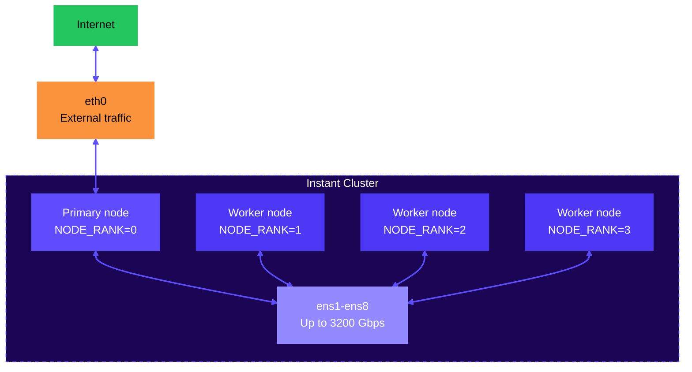

> Pinned source for Runpod main: [instant-clusters.mdx](https://github.com/runpod/docs/blob/2ed145e18217c606416d3dbc47314da01a479792/instant-clusters.mdx)
> Canonical documentation: https://docs.runpod.io/instant-clusters

# Overview

Fully managed compute clusters for multi-node training and AI inference. Review configuration and operations guidance for Runpod Clusters.

Instant Clusters provide fully managed multi-node compute with high-performance networking for distributed workloads. Deploy training jobs or large-scale inference without managing infrastructure, networking, or cluster configuration.

- **Scale beyond single machines**: Train models too large for one GPU, or accelerate training across multiple nodes.
- **High-speed networking**: 1600-3200 Gbps between nodes for efficient gradient synchronization and data movement.
- **Zero configuration**: Pre-configured static IPs, environment variables, and framework support.
- **On-demand**: Deploy in minutes, pay only for what you use.

## Get started

For distributed inference across multiple nodes, follow the [Ray and vLLM deployment guide](https://docs.runpod.io/instant-clusters/ray-vllm).

- [Deploy a Slurm cluster](https://docs.runpod.io/instant-clusters/slurm-clusters)

  Managed Slurm for HPC workloads.
- [PyTorch distributed training](https://docs.runpod.io/instant-clusters/pytorch)

  Multi-node PyTorch for deep learning.
- [Axolotl fine-tuning](https://docs.runpod.io/instant-clusters/axolotl)

  Fine-tune LLMs across multiple GPUs.
- [Distributed inference with Ray and vLLM](https://docs.runpod.io/instant-clusters/ray-vllm)

  Serve models across multiple nodes with Ray and vLLM.

## How it works

Runpod provisions multiple GPU nodes in the same data center connected with high-speed networking. One node is designated primary (`NODE_RANK=0`), and all nodes receive pre-configured environment variables for distributed communication.

The high-speed interfaces (`ens1`-`ens8`) handle inter-node communication for PyTorch, TensorFlow, and Slurm. The `eth0` interface on the primary node handles external traffic. See the [configuration reference](https://docs.runpod.io/instant-clusters/configuration) for environment variables and network details.

## Supported hardware

| GPU  | Network speed | Nodes                  |
| ---- | ------------- | ---------------------- |
| B200 | 3200 Gbps     | 2-8 nodes (16-64 GPUs) |
| H200 | 3200 Gbps     | 2-8 nodes (16-64 GPUs) |
| H100 | 3200 Gbps     | 2-8 nodes (16-64 GPUs) |
| A100 | 1600 Gbps     | 2-8 nodes (16-64 GPUs) |

For clusters larger than 8 nodes (up to 512 GPUs), [contact our sales team](https://ecykq.share.hsforms.com/2MZdZATC3Rb62Dgci7knjbA).

## Pricing

Pricing is based on GPU type and number of nodes. See [Instant Clusters pricing](https://www.runpod.io/pricing) for current rates.

Custom pricing is available for enterprise workloads. [Contact our sales team](https://ecykq.share.hsforms.com/2MZdZATC3Rb62Dgci7knjbA) for details.

> **Note**
>
> All accounts have a default spending limit. To deploy larger clusters, contact <help@runpod.io>.
