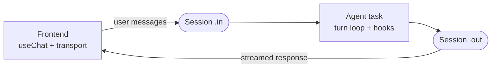

> Release-pinned source for Trigger.dev v4.5.16: [docs/ai-chat/anatomy.mdx](https://trigger.dev/docs/ai-chat/anatomy)

# Anatomy of an agent

The moving parts of a chat agent — the agent task, the session, the frontend transport — and which page covers each.

**A chat agent is three parts: a long-lived agent task that runs the turn loop, a durable Session carrying messages in and the response stream out, and a frontend transport that plugs the session into `useChat`.** The pages in this section each own one part of that picture. This page is the map — if you'd rather read mechanics end to end, skip to [How it works](https://trigger.dev/docs/ai-chat/how-it-works).



Everything below maps onto one annotated agent:

```ts trigger/my-agent.ts
import { chat } from "@trigger.dev/sdk/ai";
import { streamText, stepCountIs } from "ai";
import { anthropic } from "@ai-sdk/anthropic";

export const myAgent = chat.agent({
  id: "my-agent",

  // Tools declared on the config survive history re-conversion
  // across turns — see Tools.
  tools: { searchDocs },

  // Hooks fire around each turn: validation, persistence,
  // post-turn work — see Lifecycle hooks.
  onTurnComplete: async ({ responseMessage }) => {
    await db.messages.save(responseMessage);
  },

  // The turn loop. Messages arrive accumulated; you stream back.
  // Options, levels, and alternatives — see Backend.
  run: async ({ messages, tools, signal }) =>
    streamText({
      ...chat.toStreamTextOptions({ tools }),
      model: anthropic("claude-sonnet-4-5"),
      messages,
      abortSignal: signal,
      stopWhen: stepCountIs(15),
    }),
});
```

The frontend side is one hook — `useTriggerChatTransport` connects `useChat` to the agent's session, no API routes ([Frontend](https://trigger.dev/docs/ai-chat/frontend)). Underneath, the conversation lives on a [Session](https://trigger.dev/docs/ai-chat/sessions): a pair of durable streams keyed on your `chatId` that survives refreshes, deploys, and run boundaries.

## Where each part is covered

| Part                                                  | Page                                                                |
| ----------------------------------------------------- | ------------------------------------------------------------------- |
| `chat.agent()` options, the turn loop, piping         | [Backend](https://trigger.dev/docs/ai-chat/backend)                 |
| Hooks around each turn (`onTurnComplete`, hydration)  | [Lifecycle hooks](https://trigger.dev/docs/ai-chat/lifecycle-hooks) |
| Declaring tools, typed payloads, `toModelOutput`      | [Tools](https://trigger.dev/docs/ai-chat/tools)                     |
| `useChat` wiring, tokens, starting sessions           | [Frontend](https://trigger.dev/docs/ai-chat/frontend)               |
| Driving a chat from your server instead of a browser  | [Server-side chat](https://trigger.dev/docs/ai-chat/server-chat)    |
| The durable substrate under every agent               | [Sessions](https://trigger.dev/docs/ai-chat/sessions)               |
| Per-run typed state inside the loop                   | [chat.local](https://trigger.dev/docs/ai-chat/chat-local)           |
| Type-safe payloads, client data, and messages         | [Types](https://trigger.dev/docs/ai-chat/types)                     |
| Building without the managed lifecycle                | [Custom agents](https://trigger.dev/docs/ai-chat/custom-agents)     |
| End-to-end mechanics: what survives a refresh and why | [How it works](https://trigger.dev/docs/ai-chat/how-it-works)       |

Beyond this section: [Features](https://trigger.dev/docs/ai-chat/fast-starts) covers opt-in capabilities (Head Start, compaction, steering, actions), and [Patterns](https://trigger.dev/docs/ai-chat/patterns/sub-agents) covers production recipes (sub-agents, HITL approvals, persistence, recovery).
