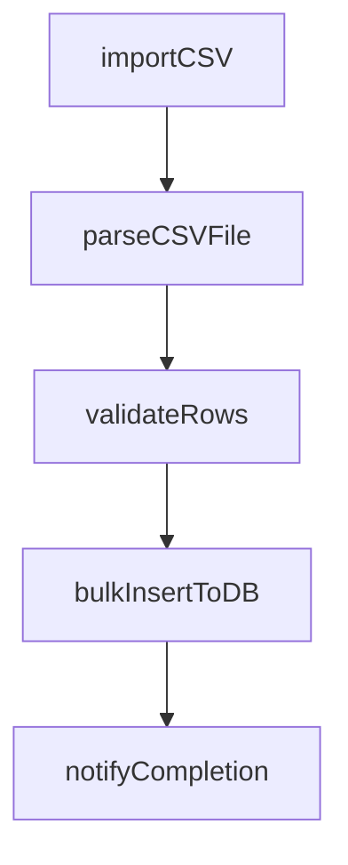
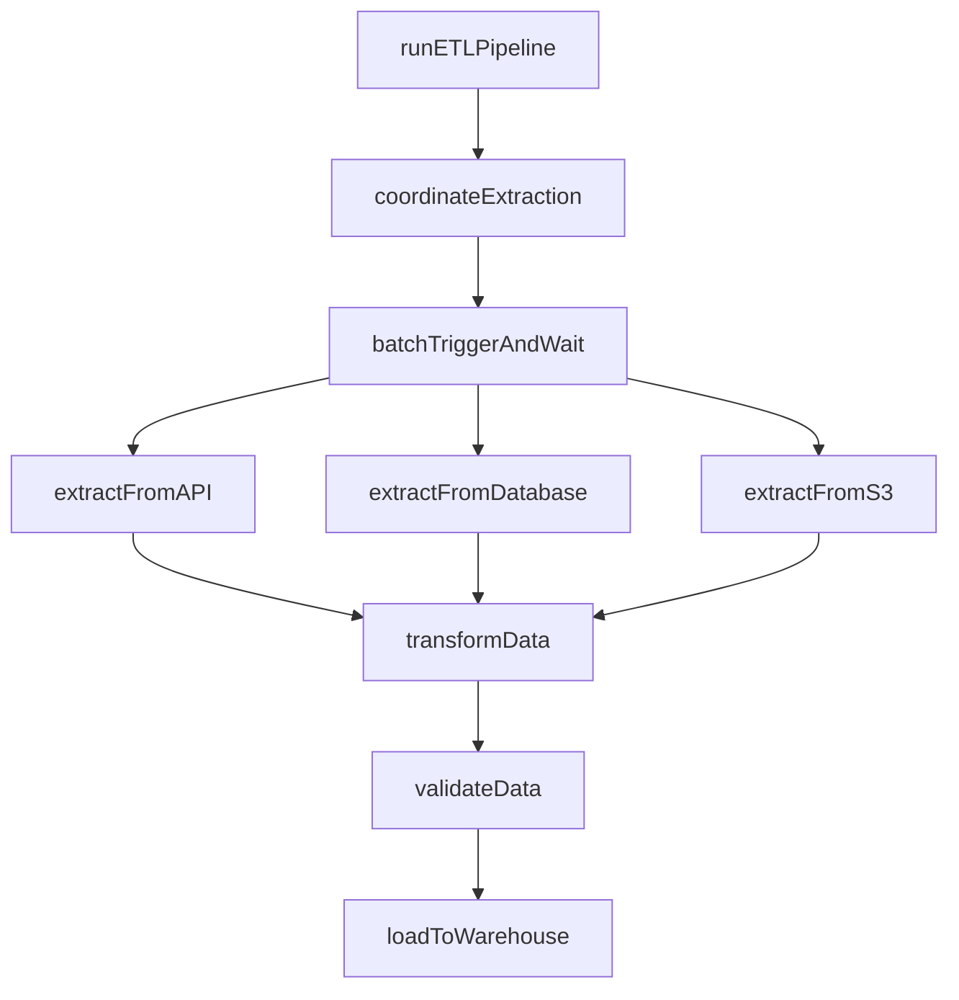
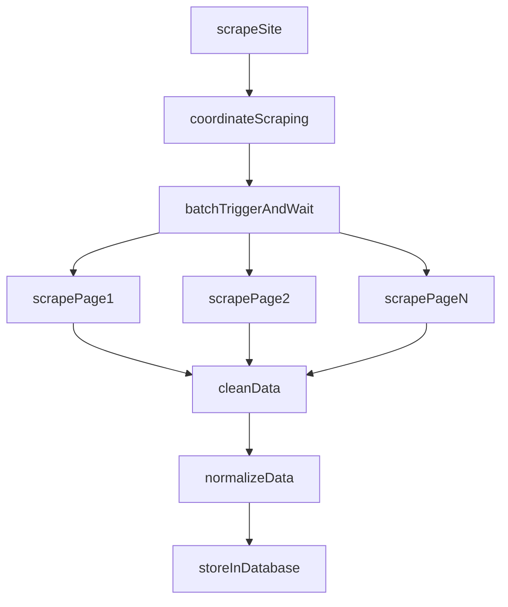
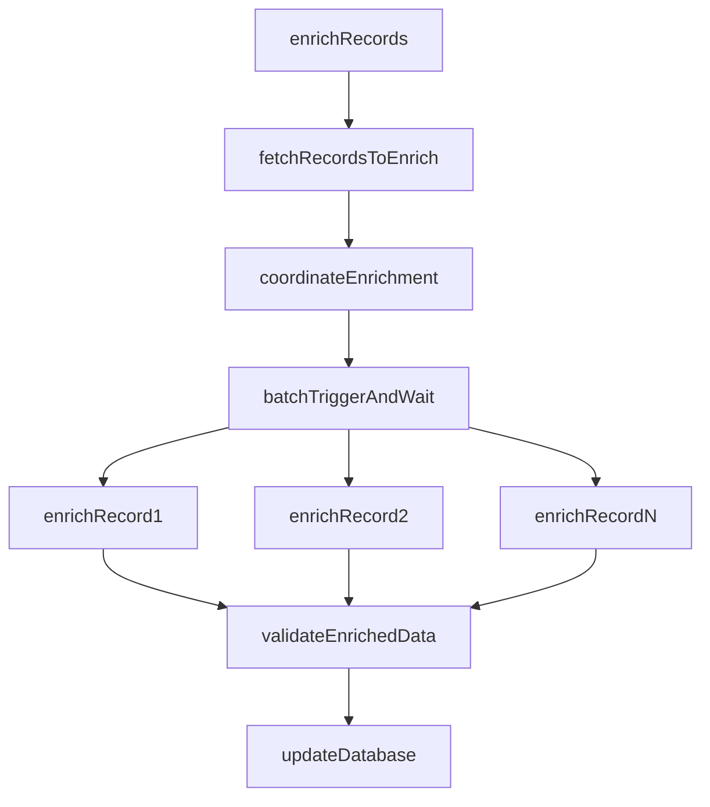

> Release-pinned source for Trigger.dev v4.5.16: [docs/guides/use-cases/data-processing-etl.mdx](https://trigger.dev/docs/guides/use-cases/data-processing-etl)

# Data processing & ETL workflows

Learn how to use Trigger.dev for data processing and ETL (Extract, Transform, Load), including web scraping, database synchronization, batch enrichment and more.

## Overview

Build complex data pipelines that process large datasets without timeouts. Handle streaming analytics, batch enrichment, web scraping, database sync, and file processing with automatic retries and progress tracking.

## Featured examples

- [Realtime CSV importer](https://trigger.dev/docs/guides/example-projects/realtime-csv-importer)

  Import CSV files with progress streamed live to frontend.
- [Web scraper with BrowserBase](https://trigger.dev/docs/guides/examples/scrape-hacker-news)

  Scrape websites using BrowserBase and Puppeteer.
- [Supabase database webhooks](https://trigger.dev/docs/guides/frameworks/supabase-edge-functions-database-webhooks)

  Trigger tasks from Supabase database webhooks.

## Benefits of using Trigger.dev for data processing & ETL workflows

**Process datasets for hours without timeouts:** Handle multi-hour transformations, large file processing, or complete database exports. No execution time limits.

**Parallel processing with built-in rate limiting:** Process thousands of records simultaneously while respecting API rate limits. Scale efficiently without overwhelming downstream services.

**Stream progress to your users in real-time:** Show row-by-row processing status updating live in your dashboard. Users see exactly where processing is and how long remains.

## Production use cases

- [MagicSchool AI customer story](https://trigger.dev/customers/magicschool-ai-customer-story)

  Read how MagicSchool AI uses Trigger.dev to generate insights from millions of student interactions.
- [Comp AI customer story](https://trigger.dev/customers/comp-ai-customer-story)

  Read how Comp AI uses Trigger.dev to automate evidence collection at scale, powering their open source, AI-driven compliance platform.
- [Midday customer story](https://trigger.dev/customers/midday-customer-story)

  Read how Midday use Trigger.dev to sync large volumes of bank transactions in their financial management platform.

## Example workflow patterns

Simple CSV import pipeline. Receives file upload, parses CSV rows, validates data, imports to database with progress tracking.

**Coordinator pattern with parallel extraction**. Batch triggers parallel extraction from multiple sources (APIs, databases, S3), transforms and validates data, loads to data warehouse with monitoring.

**Coordinator pattern with browser automation**. Launches headless browsers in parallel to scrape multiple pages, extracts structured data, cleans and normalizes content, stores in database.

**Coordinator pattern with rate limiting**. Fetches records needing enrichment, batch triggers parallel API calls with configurable concurrency to respect rate limits, validates enriched data, updates database.

## Featured use cases

- [Data processing & ETL workflows](https://trigger.dev/docs/guides/use-cases/data-processing-etl)

  Build complex data pipelines that process large datasets without timeouts.
- [Media processing workflows](https://trigger.dev/docs/guides/use-cases/media-processing)

  Batch process videos, images, audio, and documents with no execution time limits.
- [AI media generation workflows](https://trigger.dev/docs/guides/use-cases/media-generation)

  Generate images, videos, audio, documents and other media using AI models.
- [Marketing workflows](https://trigger.dev/docs/guides/use-cases/marketing)

  Build drip campaigns, create marketing content, and orchestrate multi-channel campaigns.
