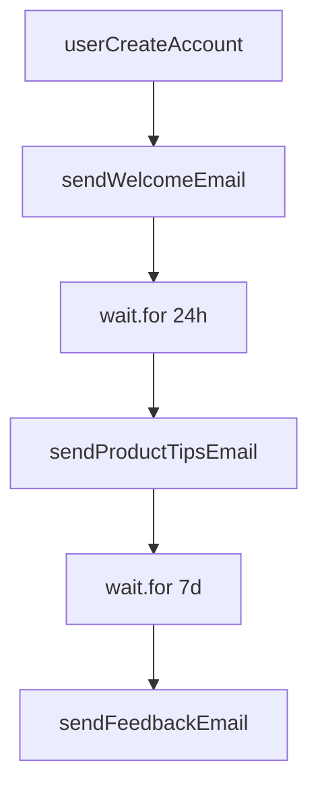
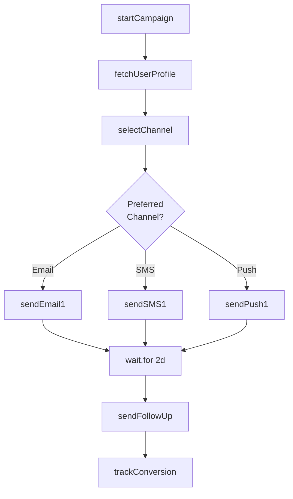
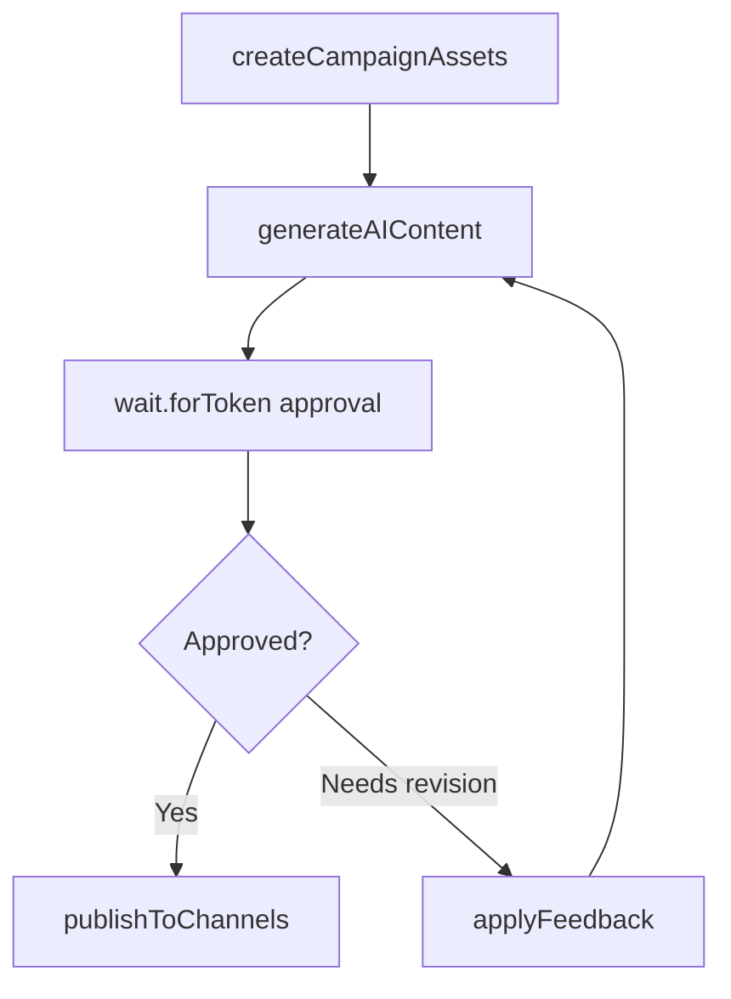
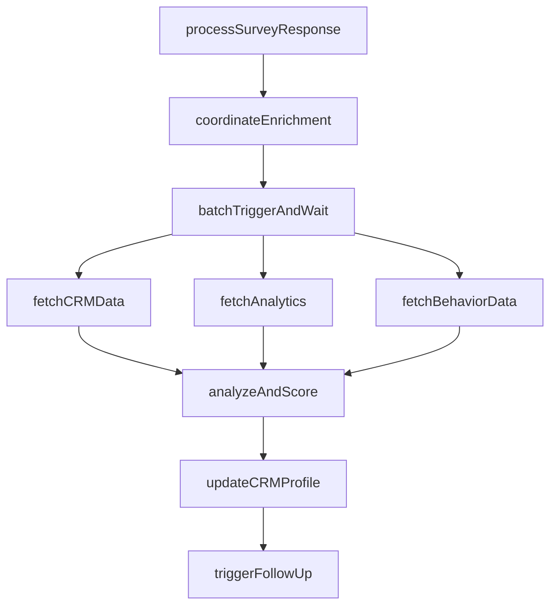

> Release-pinned source for Trigger.dev v4.5.16: [docs/guides/use-cases/marketing.mdx](https://trigger.dev/docs/guides/use-cases/marketing)

# Marketing workflows

Learn how to use Trigger.dev for marketing workflows, including drip campaigns, behavioral triggers, personalization engines, and AI-powered content workflows

## Overview

Build marketing workflows from email drip sequences to orchestrating full multi-channel campaigns. Handle multi-day sequences, behavioral triggers, dynamic content generation, and build live analytics dashboards.

## Featured examples

- [Email sequences with Resend](https://trigger.dev/docs/guides/examples/resend-email-sequence)

  Send multi-day email sequences with wait delays between messages.
- [Product image generator](https://trigger.dev/docs/guides/example-projects/product-image-generator)

  Transform product photos into professional marketing images using Replicate.
- [Human-in-the-loop workflow](https://trigger.dev/docs/guides/example-projects/human-in-the-loop-workflow)

  Approve marketing content using a human-in-the-loop workflow.

## Benefits of using Trigger.dev for marketing workflows

**Delays without idle costs:** Wait hours or weeks between steps. Waits over 5 seconds are automatically checkpointed and don't count towards compute usage. Perfect for drip campaigns and scheduled follow-ups.

**Guaranteed delivery:** Messages send exactly once, even after retries. Personalized content isn't regenerated on failure.

**Scale without limits:** Process thousands in parallel while respecting rate limits. Send to entire segments without overwhelming APIs.

## Production use cases

- [Icon customer story](https://trigger.dev/customers/icon-customer-story)

  Read how Icon uses Trigger.dev to process and generate thousands of videos per month for their AI-driven video creation platform.

## Example workflow patterns

Simple drip campaign. User signs up, waits specified delay, sends personalized email, tracks engagement.

**Router pattern with delay orchestration**. User action triggers campaign, router selects channel based on preferences (email/SMS/push), coordinates multi-day sequence with delays between messages, tracks engagement across channels.

**Supervisor pattern with approval gate**. Generates AI marketing content (images, copy, assets), pauses with wait.forToken for human review, applies revisions if needed, publishes to channels after approval.

**Coordinator pattern with enrichment**. User completes survey, batch triggers parallel enrichment from CRM/analytics, analyzes and scores responses, updates customer profiles, triggers personalized follow-up campaigns.

## Featured use cases

- [Data processing & ETL workflows](https://trigger.dev/docs/guides/use-cases/data-processing-etl)

  Build complex data pipelines that process large datasets without timeouts.
- [Media processing workflows](https://trigger.dev/docs/guides/use-cases/media-processing)

  Batch process videos, images, audio, and documents with no execution time limits.
- [AI media generation workflows](https://trigger.dev/docs/guides/use-cases/media-generation)

  Generate images, videos, audio, documents and other media using AI models.
- [Marketing workflows](https://trigger.dev/docs/guides/use-cases/marketing)

  Build drip campaigns, create marketing content, and orchestrate multi-channel campaigns.
