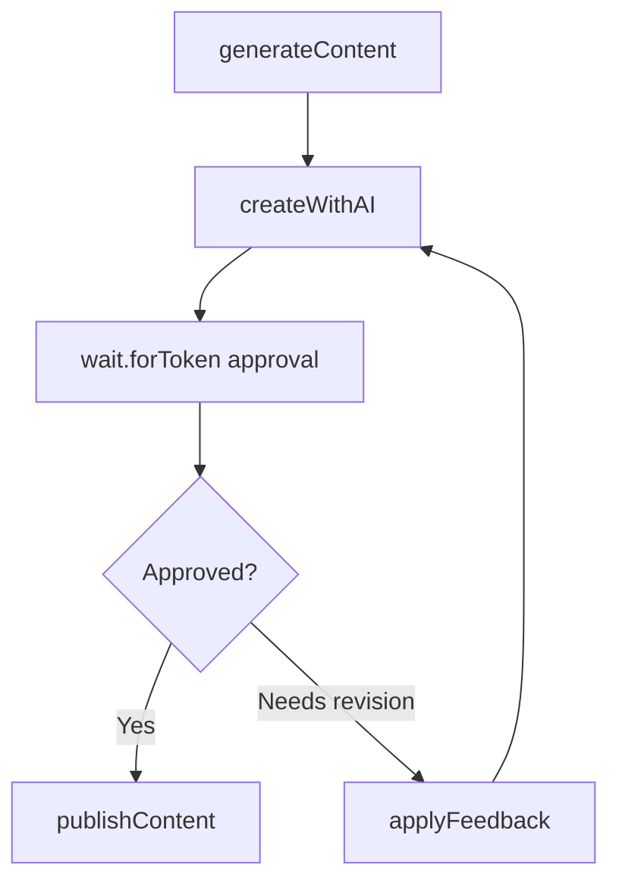
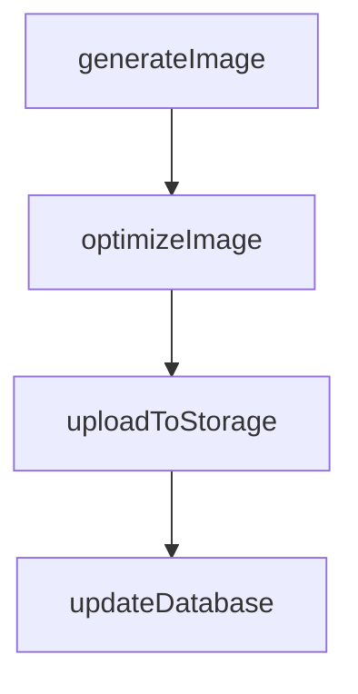
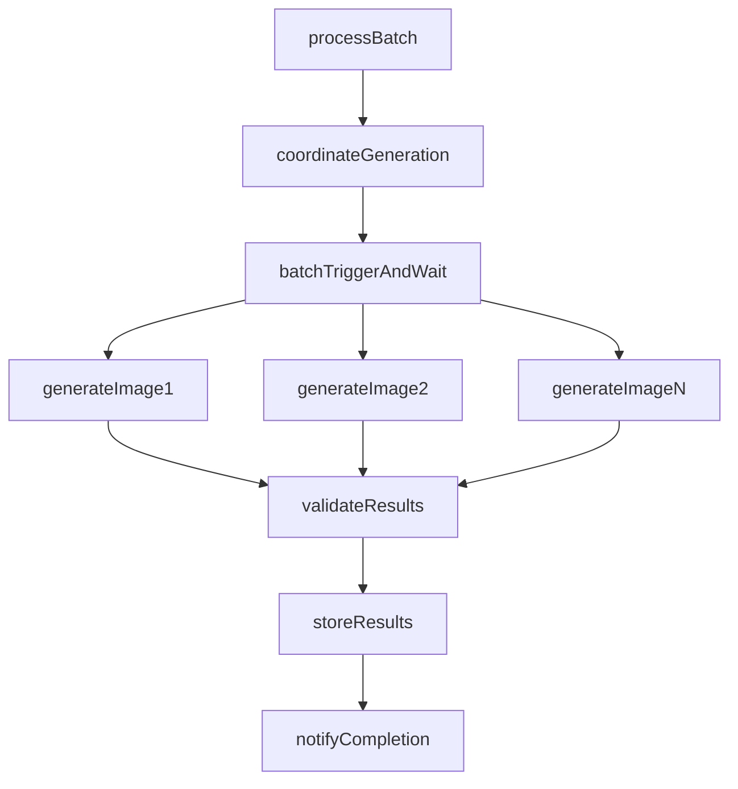
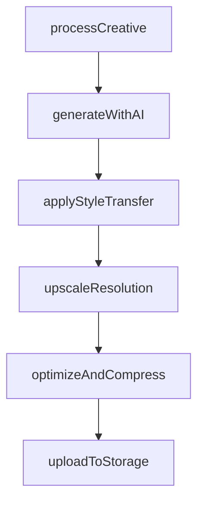

> Release-pinned source for Trigger.dev v4.5.16: [docs/guides/use-cases/media-generation.mdx](https://trigger.dev/docs/guides/use-cases/media-generation)

# AI media generation workflows

Learn how to use Trigger.dev for AI media generation including image creation, video synthesis, audio generation, and multi-modal content workflows

## Overview

Build AI media generation pipelines that handle unpredictable API latencies and long-running operations. Generate images, videos, audio, and multi-modal content with automatic retries, progress tracking, and no timeout limits.

## Featured examples

- [Product image generator](https://trigger.dev/docs/guides/example-projects/product-image-generator)

  Transform product photos into professional marketing images using Replicate.
- [Meme generator (human-in-the-loop)](https://trigger.dev/docs/guides/example-projects/meme-generator-human-in-the-loop)

  Generate memes with DALL·E 3 and add human approval steps.
- [Vercel AI SDK image generation](https://trigger.dev/docs/guides/example-projects/vercel-ai-sdk-image-generator)

  Generate images from text prompts using the Vercel AI SDK.

## Benefits of using Trigger.dev for AI media generation workflows

**Pay only for active compute, not AI inference time:** Checkpoint-resume pauses during AI API calls. Generate content that takes minutes or hours without paying for idle inference time.

**No timeout limits for long generations:** Handle generations that take minutes or hours without execution limits. Perfect for high-quality video synthesis and complex multi-modal workflows.

**Human approval gates for brand safety:** Add review steps before publishing AI-generated content. Pause workflows for human approval using waitpoint tokens.

## Production use cases

- [Icon customer story](https://trigger.dev/customers/icon-customer-story)

  Read how Icon uses Trigger.dev to process and generate thousands of videos per month for their AI-driven video creation platform.
- [Papermark customer story](https://trigger.dev/customers/papermark-customer-story)

  Read how Papermark process thousands of documents per month using Trigger.dev.

## Example workflow patterns

**Supervisor pattern with approval gate**. Generates AI content, pauses execution with wait.forToken to allow human review, applies feedback if needed, publishes approved content.

Simple AI image generation. Receives prompt and parameters, calls OpenAI DALL·E 3, post-processes result, uploads to storage.

**Coordinator pattern with rate limiting**. Receives batch of generation requests, coordinates parallel processing with configurable concurrency to respect API rate limits, validates outputs, stores results.

**Coordinator pattern with sequential processing**. Generates initial content with AI, applies style transfer or enhancement, upscales resolution, optimizes and compresses for delivery.

## Featured use cases

- [Data processing & ETL workflows](https://trigger.dev/docs/guides/use-cases/data-processing-etl)

  Build complex data pipelines that process large datasets without timeouts.
- [Media processing workflows](https://trigger.dev/docs/guides/use-cases/media-processing)

  Batch process videos, images, audio, and documents with no execution time limits.
- [AI media generation workflows](https://trigger.dev/docs/guides/use-cases/media-generation)

  Generate images, videos, audio, documents and other media using AI models.
- [Marketing workflows](https://trigger.dev/docs/guides/use-cases/marketing)

  Build drip campaigns, create marketing content, and orchestrate multi-channel campaigns.
