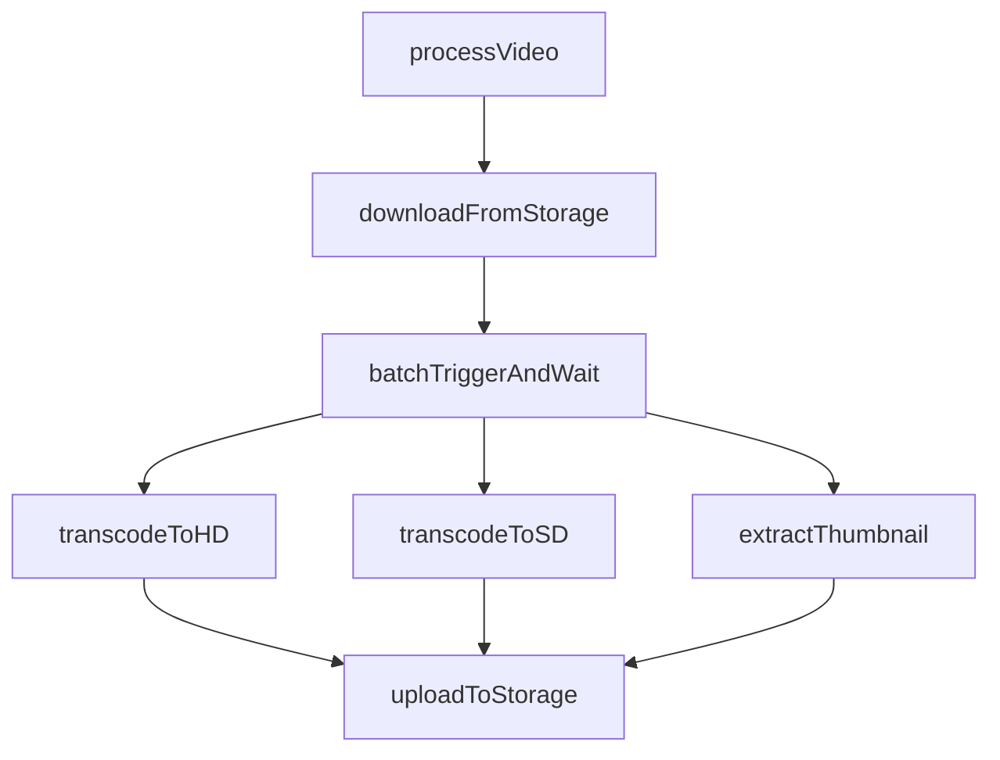
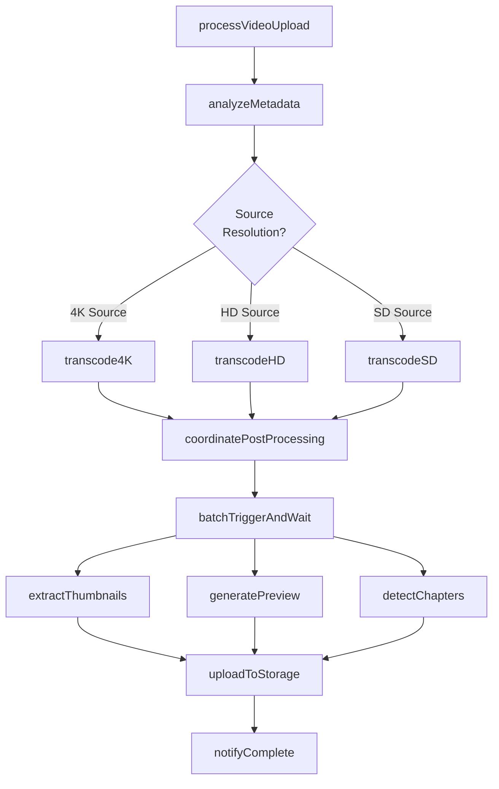
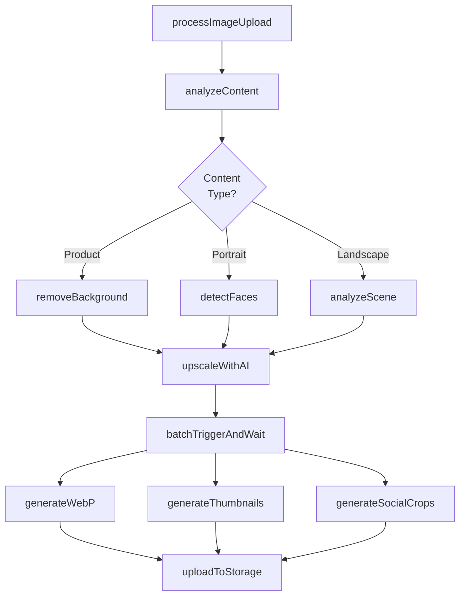
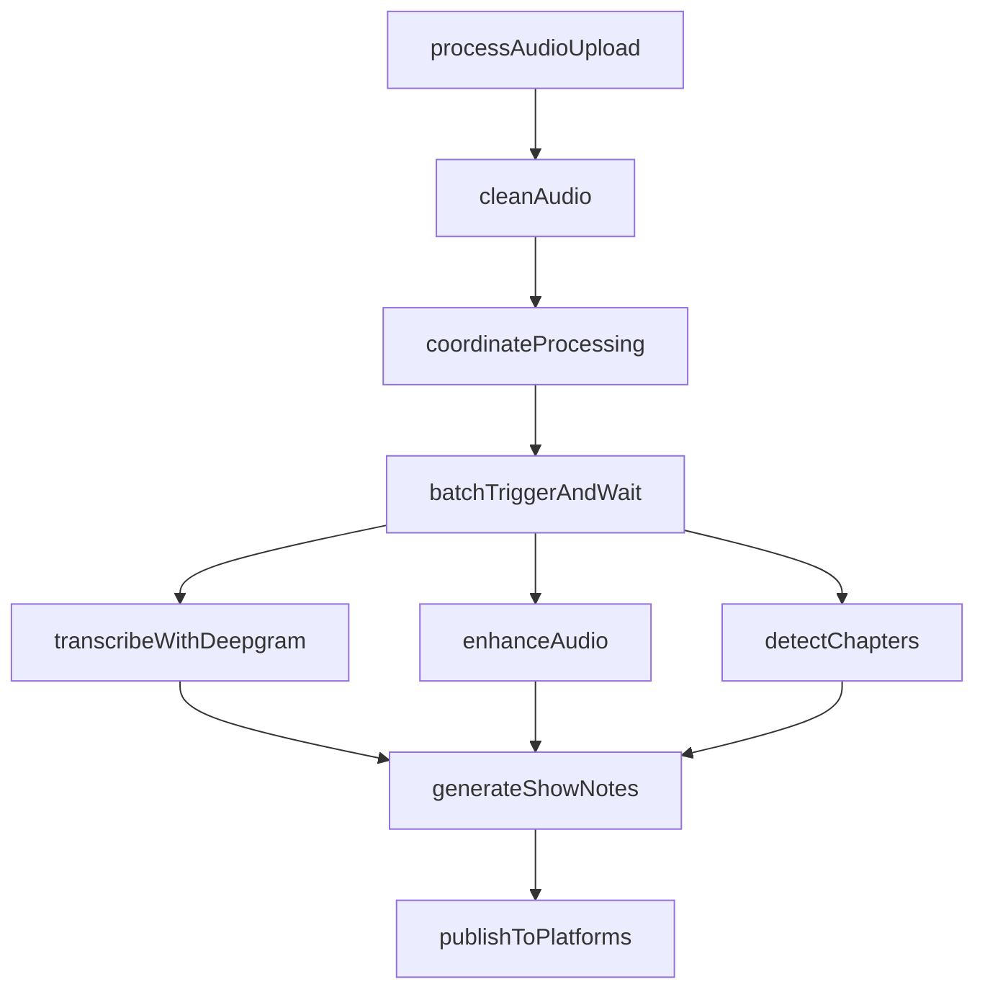
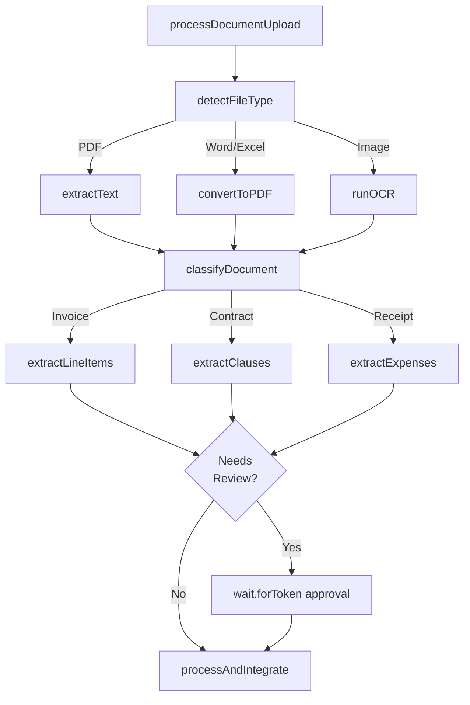

> Release-pinned source for Trigger.dev v4.5.16: [docs/guides/use-cases/media-processing.mdx](https://trigger.dev/docs/guides/use-cases/media-processing)

# Media processing workflows

Learn how to use Trigger.dev for media processing including video transcoding, image optimization, audio transformation, and document conversion.

## Overview

Build media processing pipelines that handle large files and long-running operations. Process videos, images, audio, and documents with automatic retries, progress tracking, and no timeout limits.

## Featured examples

- [FFmpeg video processing](https://trigger.dev/docs/guides/examples/ffmpeg-video-processing)

  Process videos and upload results to R2 storage using FFmpeg.
- [Product image generator](https://trigger.dev/docs/guides/example-projects/product-image-generator)

  Transform product photos into professional marketing images using Replicate.
- [LibreOffice PDF conversion](https://trigger.dev/docs/guides/examples/libreoffice-pdf-conversion)

  Convert documents to PDF using LibreOffice.

## Benefits of using Trigger.dev for media processing workflows

**Process multi-hour videos without timeouts:** Transcode videos, extract frames, or run CPU-intensive operations for hours. No execution time limits.

**Stream progress to users in real-time:** Show processing status updating live in your UI. Users see exactly where encoding is and how long remains.

**Parallel processing with resource control:** Process hundreds of files simultaneously with configurable concurrency limits. Control resource usage without overwhelming infrastructure.

## Example workflow patterns

Simple video transcoding pipeline. Downloads video from storage, batch triggers parallel transcoding to multiple formats and thumbnail extraction, uploads all results.

**Router + Coordinator pattern**. Analyzes video metadata to determine source resolution, routes to appropriate transcoding preset, batch triggers parallel post-processing for thumbnails, preview clips, and chapter detection.

**Router + Coordinator pattern**. Analyzes image content to detect type, routes to specialized processing (background removal for products, face detection for portraits, scene analysis for landscapes), upscales with AI, batch triggers parallel variant generation.

**Coordinator pattern**. Pre-processes raw audio with noise reduction and speaker diarization, batch triggers parallel tasks for transcription (Deepgram), audio enhancement, and chapter detection, aggregates results to generate show notes and publish.

**Router pattern with human-in-the-loop**. Detects file type and routes to appropriate processor, classifies document with AI to determine type (invoice/contract/receipt), extracts structured data fields, optionally pauses with wait.forToken for human approval.

## Featured use cases

- [Data processing & ETL workflows](https://trigger.dev/docs/guides/use-cases/data-processing-etl)

  Build complex data pipelines that process large datasets without timeouts.
- [Media processing workflows](https://trigger.dev/docs/guides/use-cases/media-processing)

  Batch process videos, images, audio, and documents with no execution time limits.
- [AI media generation workflows](https://trigger.dev/docs/guides/use-cases/media-generation)

  Generate images, videos, audio, documents and other media using AI models.
- [Marketing workflows](https://trigger.dev/docs/guides/use-cases/marketing)

  Build drip campaigns, create marketing content, and orchestrate multi-channel campaigns.
